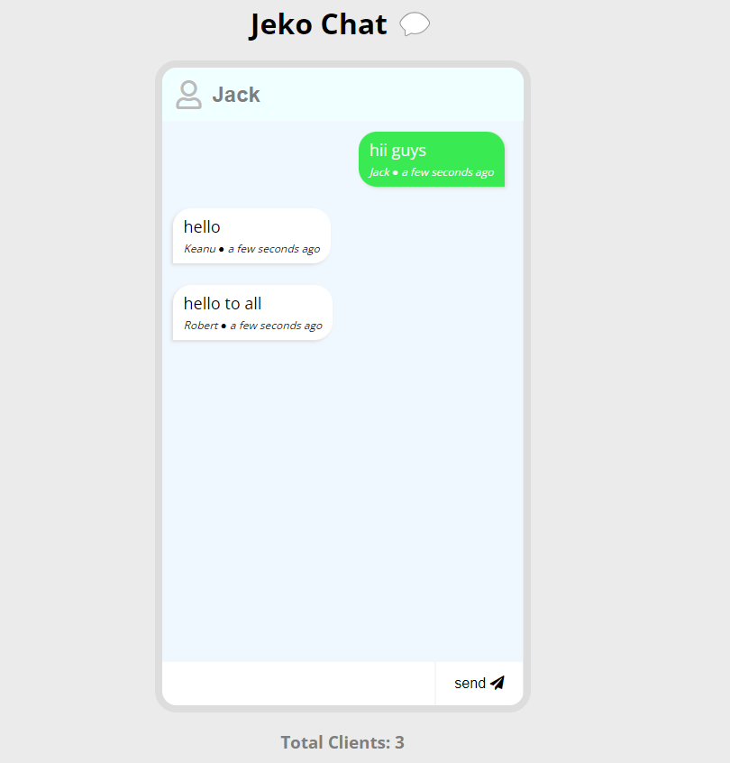

# Group Chat Application

A real-time group chat application using WebSocket for instant messaging.


## Table of Contents
- [Introduction](#introduction)
- [Features](#features)
- [Installation](#installation)
- [Usage](#usage)
- [Contributing](#contributing)
- [License](#license)

## Introduction

The Group Chat Application is a real-time chat platform built with WebSocket technology, allowing users to create and join chat rooms for group discussions. It enables instant messaging with features like user typing feedback and message notifications.

## Features

- Create and join chat rooms.
- Real-time messaging with WebSocket.
- User typing feedback.
- Notification for new messages.
- Chat history for recent messages.

## Installation


1. Clone the repository:

   ```bash
   git clone https://github.com/yourusername/group-chat-app.git
